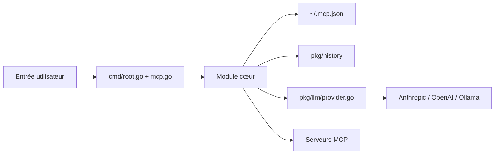

# mark3labs/mcphost

> Interface en ligne de commande qui relie des LLM à des serveurs MCP ; abandonnée au profit de Kit.

## Le problème
Un modèle de langage seul ne peut pas appeler d'outils externes ; il faut un hôte qui gère les connexions MCP et l'historique.

## Ce que ça fait vraiment
Programme Go qui lance des conversations interactives ou en mode non interactif (`-p`), avec Claude, OpenAI, Gemini, Ollama ou un endpoint compatible OpenAI. Il pilote plusieurs serveurs MCP (locaux, distants, intégrés fs/bash/todo/http), filtre les outils par serveur, propose des scripts YAML, des hooks avant/après outil et un SDK Go. Le README annonce l'arrêt du développement et renvoie à Kit.

## Comment c'est branché


## Essayer
```bash
go install github.com/mark3labs/mcphost@latest
mcphost
mcphost -p "What is 2+2?" --quiet
mcphost -m ollama/qwen2.5:3b
```

## Coût et pièges
Clé d'API du fournisseur choisi à ta charge, ou Ollama local. Les hooks exécutent des commandes arbitraires ; `--tls-skip-verify` désactive la vérification TLS.

## Ce que ce n'est pas
Ce n'est plus maintenu : dépôt archivé, pas de correctifs. Le README est en partie tronqué (blocs de code mal fermés).

## Alternatives
Kit, le successeur nommé en tête du README.

## Pour toi
À ignorer : archivé, et son successeur Kit est le point d'entrée logique pour un hôte MCP en CLI.
