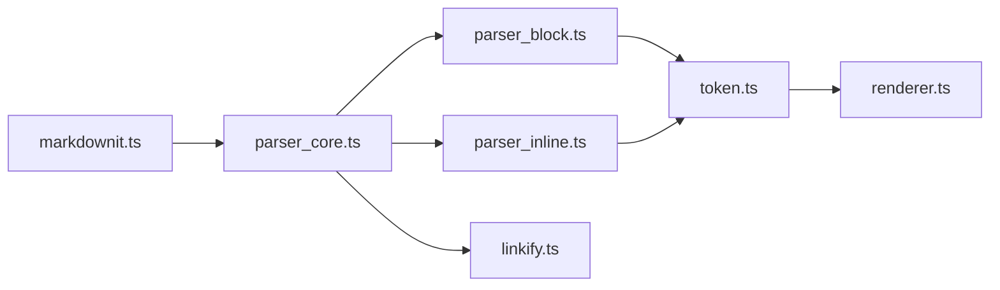

# markdown-it/markdown-it

> Analyseur Markdown extensible en JavaScript, conforme CommonMark, pour développeurs d'outils ou de sites.

## Le problème
Convertir du Markdown en HTML de manière fiable, sûre et personnalisable (syntaxes ajoutées ou remplacées).

## Ce que ça fait vraiment
Une instance `MarkdownIt` prend un texte, enchaîne règles du cœur, analyse de blocs puis d'inlines, produit un flux de tokens, que le renderer transforme en HTML. Suit CommonMark avec extensions (autolien d'URL, typographie), règles remplaçables, « sûr par défaut ». Des plugins communautaires existent sur npm.

## Comment c'est branché


## Essayer
```bash
npm install markdown-it
```
```js
import MarkdownIt from 'markdown-it'
const md = new MarkdownIt()
const result = md.render('# markdown-it rulezz!')
```

## Coût et pièges
Gratuit. Une note du README signale une migration à faire pour passer en v15.

## Ce que ce n'est pas
Pas un éditeur ni un moteur de templates : il convertit seulement le Markdown en HTML.

## Alternatives
Aucune alternative nommée dans le README.

## Pour toi
Bon choix si tu génères des rapports ou une interface de chat/RAG en JS qui affiche du Markdown ; en Python, hors périmètre.

