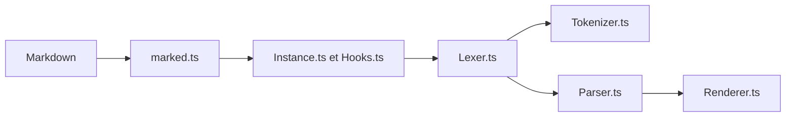

# markedjs/marked

> Compilateur Markdown vers HTML en JavaScript, pour navigateur, serveur et ligne de commande.

## Le problème
Afficher du Markdown (documents, sorties de modèles, notes) en HTML sans dépendre d'un service externe.

## Ce que ça fait vraiment
Le point d'entrée applique les options et hooks, le lexer découpe blocs puis éléments en ligne à l'aide du tokenizer et des règles, puis le parser transforme les jetons et le renderer produit le HTML. Les extensions personnalisées et les hooks asynchrones sont documentés. Il gère les saveurs GFM.

## Comment c'est branché


## Essayer
```bash
npm install -g marked
npm install marked
marked -o hello.html
marked --help
```

## Coût et pièges
Gratuit. Le HTML produit n'est pas assaini : il faut passer la sortie dans DOMPurify, sanitize-html ou insane. Seuls les Node.js courants et LTS sont supportés.

## Ce que ce n'est pas
Ce n'est pas un assainisseur de HTML : afficher du Markdown non fiable sans filtre ouvre la porte au XSS. La licence est présente mais non identifiée par GitHub.

## Alternatives
Aucune alternative nommée dans le README (DOMPurify, sanitize-html et insane y figurent comme compléments).

## Pour toi
À adopter pour rendre du Markdown dans un tableau de bord ou une appli de démonstration, à condition d'assainir la sortie ; vérifie le texte de la licence.

