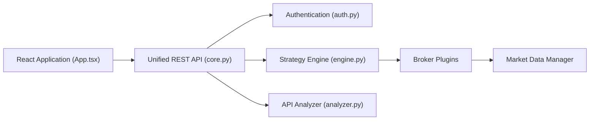

# marketcalls/openalgo

> Plateforme auto-hébergée de trading algorithmique avec API unifiée pour 36 courtiers, surtout indiens.

## Le problème
Chaque courtier a sa propre API ; écrire, tester et exécuter une stratégie oblige à recoder l'intégration.

## Ce que ça fait vraiment
Application Flask + React : API REST `/api/v1`, hébergeur de stratégies Python, constructeur visuel Flow, douze outils d'options, mode Analyzer (capital simulé de 1 crore), agent IA (LiteLLM/Ollama, chaque ordre demande ton approbation), serveur MCP, bot Telegram. Cinq bases SQLite et une DuckDB.

## Comment c'est branché


## Essayer
```bash
git clone --filter=blob:none https://github.com/marketcalls/openalgo.git
cd openalgo
pip install uv
cp .sample.env .env
uv run app.py
```

## Coût et pièges
Compte chez un courtier pris en charge et identifiants API dans `.env`. Python 3.12+. L'agent IA appelle des modèles à ta charge. Le README rappelle que le trading fait perdre de l'argent.

## Ce que ce n'est pas
Pas un moteur de prédiction : c'est de l'exécution et du test. Couverture centrée sur les marchés que servent ces courtiers.

## Alternatives
Aucune alternative nommée dans le README.

## Pour toi
À ignorer sauf projet de trading : hors du cœur data/MLOps, dépendant de courtiers précis et d'une licence AGPL.
