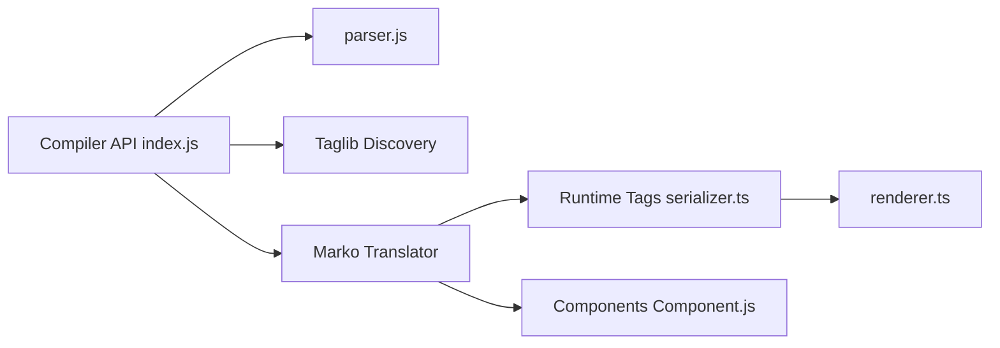

# marko-js/marko

> Langage déclaratif basé sur HTML pour interfaces web réactives, avec compilateur et runtimes.

## Le problème
Non documenté dans le README fourni : celui-ci se réduit à un chemin de fichier (`packages/runtime-tags/README.md`).

## Ce que ça fait vraiment
D'après l'architecture décrite d'après le code : un gabarit Marko est analysé et compilé (compilateur, taglib, plugin Babel, traducteur), puis rendu par un runtime HTML ou DOM. Le dépôt contient aussi le runtime historique à classes (composants, DOM virtuel, compatibilité jQuery).

## Comment c'est branché


## Essayer
```bash
# Aucune commande documentée dans le README fourni.
```

## Coût et pièges
Gratuit (MIT). README vide de contenu : les informations d'usage manquent ici. 35 issues ouvertes.

## Ce que ce n'est pas
Pas évaluable ici : rien de plus que l'architecture n'est fourni.

## Alternatives
Aucune alternative nommée dans le README.

## Pour toi
Pas de lien avec un profil data/IA et matière insuffisante pour trancher mieux : surveiller seulement si tu fais du rendu web côté serveur.

