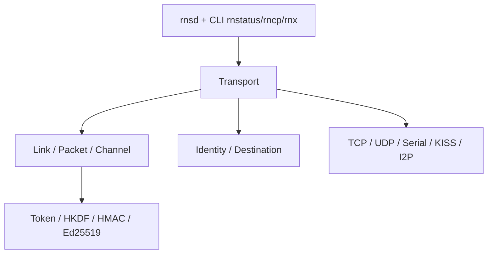

# markqvist/Reticulum

> Pile réseau chiffrée en Python, indépendante d'IP, pour bâtir des réseaux maillés résilients, même à très bas débit.

## Le problème
Les réseaux classiques dépendent d'IP, d'opérateurs et d'infrastructures centrales ; hors réseau ou sur radio à faible débit, ils ne tiennent pas.

## Ce que ça fait vraiment
Implémentation de référence en Python (userland, sans module noyau) : identités par clés Curve25519/Ed25519, liens chiffrés, routage multi-sauts auto-configuré, sans adresse source dans les paquets. Elle passe par des interfaces enfichables (TCP, UDP, série, KISS, I2P, LoRa via RNode). Fournit des utilitaires (`rnsd`, `rnstatus`, `rncp`, `rnsh`…) et une API.

## Comment c'est branché


## Essayer
```bash
pip install rns
pipx install rns
```
Puis lancer `rnsd` (démon) ; une configuration par défaut est créée au premier démarrage.

## Coût et pièges
Gratuit. Le paquet `rnspure` retire les dépendances mais bascule sur des primitives cryptographiques Python moins éprouvées. Pas d'audit de sécurité externe, selon l'auteur. Le dépôt est un miroir public ; le développement a lieu ailleurs.

## Ce que ce n'est pas
Ce n'est pas un réseau à rejoindre : c'est un outil pour en construire, et il faut trouver des points d'entrée. Le protocole n'a pas de spécification formelle : le code fait foi. La licence « Reticulum License » n'est pas reconnue par GitHub.

## Alternatives
Aucune alternative nommée dans le README ; il met en garde contre des réimplémentations non fiables.

## Pour toi
À surveiller : pertinent pour du réseau résilient ou de l'IoT hors ligne, peu pour un flux data/IA classique ; licence atypique et audit absent à peser.
