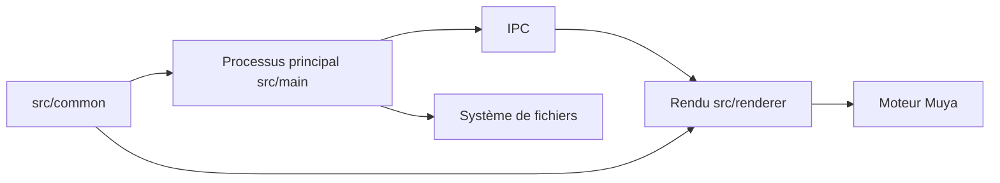

# marktext/marktext

> Éditeur Markdown de bureau avec aperçu en direct, pour rédiger notes et documents.

## Le problème
Écrire du Markdown dans un éditeur de texte sans voir le rendu oblige à alterner entre source et aperçu.

## Ce que ça fait vraiment
Éditeur Electron (moteur « Muya » maison, interface Vue) avec rendu en direct, CommonMark et GFM, formules KaTeX, front matter, export HTML et PDF, thèmes, modes source, machine à écrire et concentration, collage d'images. Disponible sur Linux, macOS et Windows, packages Homebrew, Chocolatey, Winget.

## Comment c'est branché


## Essayer
```bash
brew install --cask mark-text
choco install marktext
winget install marktext
```

## Coût et pièges
Gratuit ; sponsors visibles dans le README. macOS 11 minimum, pas de build universel : choisir arm64 ou x64.

## Ce que ce n'est pas
Ce n'est pas une application de prise de notes reliées ni un outil de publication ; le README ne décrit pas de synchronisation.

## Alternatives
Aucune alternative nommée dans le README.

## Pour toi
Adopter si tu rédiges de la documentation ou des notes en Markdown au quotidien ; sinon sans importance.

