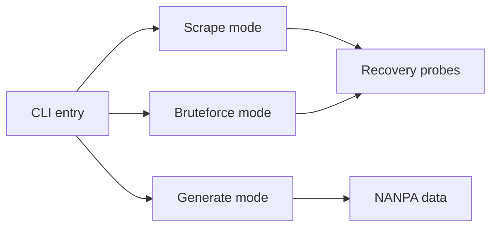

# martinvigo/email2phonenumber

> Outil OSINT de preuve de concept qui déduit un numéro de téléphone depuis une adresse e-mail.

## Le problème
Les parcours de réinitialisation de mot de passe affichent des chiffres masqués qui, recoupés, peuvent trahir un numéro de téléphone.

## Ce que ça fait vraiment
Un script Python unique avec trois modes : `scrape` (extraire les chiffres visibles lors d'une réinitialisation), `generate` (produire des numéros valides d'après un masque et le plan de numérotation) et `bruteforce` (tester des numéros pour retrouver l'e-mail masqué correspondant, via proxies). Les sites pris en charge (eBay, LastPass, Amazon, Twitter) ont depuis ajouté des protections, selon l'auteur.

## Comment c'est branché


## Essayer
```bash
pip3 install beautifulsoup4 requests
python3 email2phonenumber.py scrape -e target@email.com
python3 email2phonenumber.py generate -m 555XXX1234 -o /tmp/dic.txt
```

## Coût et pièges
Gratuit. Les méthodes décrites ne fonctionnent plus sur les services listés ; usage soumis à autorisation et à la loi.

## Ce que ce n'est pas
Pas un outil maintenu : l'auteur renvoie vers « Phonerator ». Il ne fonctionne plus tel quel sur les sites cités.

## Alternatives
Phonerator (outil plus récent du même auteur, cité dans le README).

## Pour toi
À ignorer : preuve de concept obsolète, dernier push en juillet 2024, sans lien avec un travail data ou MLOps.

