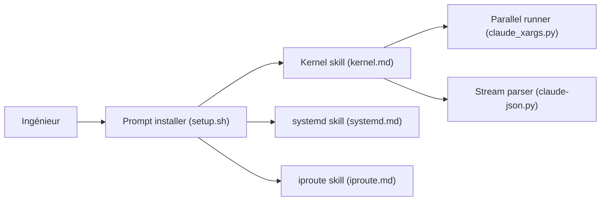

# masoncl/review-prompts

> Prompts de revue de code assistée par IA pour le noyau Linux, systemd et iproute.

## Le problème
Une IA relit mal du code système exigeant sans connaissance des motifs de bugs propres au noyau ou à systemd.

## Ce que ça fait vraiment
Fournit, par projet, un skill chargé automatiquement dans l'arbre concerné, des commandes slash de revue, de débogage et de vérification (/kreview, /kdebug, /kverify…) et des fichiers de connaissance par sous-système. Le noyau a aussi des scripts : catégoriseur de changements, parseur de sortie Claude, exécuteur parallèle. Cible aussi nfs-utils et pahole d'après le code.

## Comment c'est branché


## Essayer
```bash
./setup.sh <agent> <project>
```

## Coût et pièges
Gratuit, mais l'exécution consomme les tokens de l'agent. Marche mieux avec semcode pour la navigation de code.

## Ce que ce n'est pas
Pas un outil généraliste de revue : spécialisé C système. Le README ne précise pas la qualité mesurée des revues.

## Alternatives
Aucune alternative nommée dans le README (il cite semcode en complément).

## Pour toi
À ignorer : utile seulement si tu relis du code noyau ou systemd ; hors sujet pour un travail data/IA.

