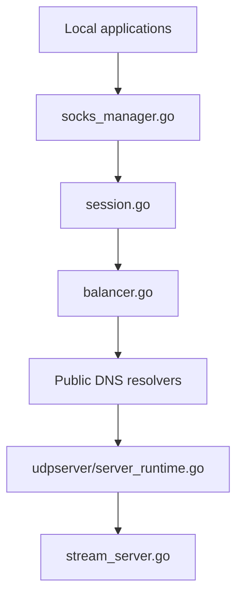

# masterking32/MasterDnsVPN

> Tunnel DNS en Go qui fait passer du trafic TCP dans des requêtes DNS, pour réseaux filtrés.

## Le problème
Sur un réseau où seul le DNS passe, les VPN classiques ne fonctionnent pas.

## Ce que ça fait vraiment
- Un client expose un proxy local SOCKS5/SOCKS4 (ou un transfert TCP fixe) ; un serveur fait office de DNS autoritatif pour un sous-domaine délégué.
- Protocole maison avec chiffrement configurable (XOR, ChaCha20, AES-GCM), ARQ, compression optionnelle, sélection et duplication multi-résolveurs, sondage de MTU.
- Les gains de vitesse face à DNSTT et SlipStream sont ceux annoncés par l'auteur (tableau du README), non vérifiés ici.
- Pas d'application mobile officielle.

## Comment c'est branché


## Essayer
```bash
bash <(curl -Ls https://raw.githubusercontent.com/masterking32/MasterDnsVPN/main/server_linux_install.sh)
cp client_config.toml.simple client_config.toml
cp server_config.toml.simple server_config.toml
cp client_resolvers.simple client_resolvers.txt
./masterdnsvpn-server -config server_config.toml
./masterdnsvpn-client -config client_config.toml
```

## Coût et pièges
Il faut un serveur, un nom de domaine avec enregistrements A et NS, et le port 53 libre (conflit possible avec `systemd-resolved`). Le script d'installation est exécuté directement depuis le réseau : le lire avant. Le XOR par défaut est le mode le plus faible.

## Ce que ce n'est pas
Pas un VPN au sens IP complet : c'est un proxy TCP. Le README le présente comme projet éducatif et de recherche, et rappelle que contourner des lois locales peut être puni ; à utiliser dans le respect du droit applicable.

## Alternatives
- SlipStream : tunnel DNS sur QUIC, en Rust.
- DNSTT : tunnel DNS classique, plus simple.

## Pour toi
Surveiller : intéressant pour l'étude de protocoles de tunnel, mais sans lien avec un flux data/IA et avec des performances non vérifiées.

