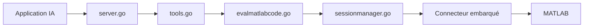

# matlab/matlab-mcp-core-server

> Serveur MCP officiel de MathWorks pour lancer MATLAB et exécuter du code depuis une application IA.

## Le problème
Un agent IA ne peut pas démarrer MATLAB, y exécuter du code ni vérifier la qualité d'un script sans pont dédié.

## Ce que ça fait vraiment
Binaire Go qui pilote une session MATLAB (nouvelle ou existante). Outils : `detect_matlab_toolboxes`, `check_matlab_code` (analyse statique), `evaluate_matlab_code`, `run_matlab_file`, `run_matlab_test_file`. Deux ressources de guides de style. Options : dossier initial, mode d'affichage, fichiers d'extension pour outils personnalisés.

## Comment c'est branché


## Essayer
```bash
claude mcp add --transport stdio matlab -- /fullpath/to/matlab-mcp-server-binary
claude mcp add --transport stdio matlab -- /fullpath/to/matlab-mcp-server-binary --initial-working-folder=/home/username/myproject
codex mcp add matlab -- /fullpath/to/matlab-mcp-server-binary
```

## Coût et pièges
Nécessite une installation MATLAB R2021a ou plus récente (licence MathWorks payante). Collecte anonyme activée par défaut (`--disable-telemetry=true`). Usage monoutilisateur : le partage entre utilisateurs est interdit sans accord MathWorks.

## Ce que ce n'est pas
Pas un MATLAB gratuit ni un serveur partageable. La licence est « présente mais non identifiée » : lire LICENSE.md.

## Alternatives
Aucune alternative nommée dans le README.

## Pour toi
À surveiller : pertinent seulement si ton équipe a déjà MATLAB ; sinon sans intérêt, et vérifie les clauses de licence avant tout usage partagé.

