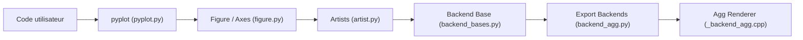

# matplotlib/matplotlib

> Bibliothèque Python de référence pour tracer des figures statiques, animées ou interactives.

## Le problème
Produire des graphiques reproductibles et exportables (PDF, SVG, PNG) depuis du code Python, sur écran comme en fichier, sans dépendre d'un outil graphique.

## Ce que ça fait vraiment
`pyplot` ou l'API objet (`Figure`, `Axes`) construisent un graphe d'artistes en mémoire.
Un backend le rend : GUI (Qt, Tk, GTK, macOS, WebAgg) ou export (Agg, PDF, SVG, PS, Cairo, PGF).
Le rendu raster, les polices et la triangulation passent par des extensions natives C/C++ (`src/`, Agg, FreeType).
Toolkits fournis : `mplot3d`, `axes_grid1`, `axisartist`.

## Comment c'est branché

## Essayer
Aucune commande d'installation dans le README : il renvoie à la documentation d'installation en ligne.

## Coût et pièges
Gratuit. Compilation native gérée par les wheels ; pas de piège particulier documenté.

## Ce que ce n'est pas
Pas une bibliothèque de dashboards web interactifs. La licence n'est pas identifiée par GitHub dans le catalogue : à vérifier, même si le projet est largement diffusé.

## Alternatives
Aucune alternative nommée dans le README.

## Pour toi
À adopter, c'est déjà ton socle : standard de fait pour les figures d'analyse et de publication, interfacé avec pandas et la plupart des outils ML.
