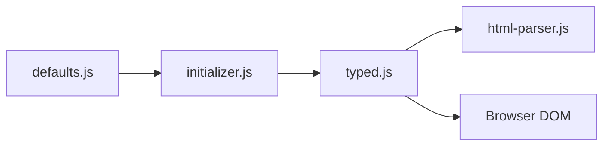

# mattboldt/typed.js

> Bibliothèque JavaScript qui simule une saisie au clavier animée dans un élément de page.

## Le problème
Faire apparaître un texte lettre par lettre, avec effacement et boucle, sans écrire les minuteries soi-même.

## Ce que ça fait vraiment
On crée `new Typed('#element', {strings, typeSpeed…})`. La lib initialise les options, tape, fait des pauses (`^1000`), efface (avec effacement intelligent), enchaîne les phrases, boucle. Gère le HTML, un curseur personnalisable, le fondu, et des callbacks de cycle de vie. Exemples React, CDN, composant Vue et web component tiers.

## Comment c'est branché


## Essayer
```bash
npm install typed.js
```
```js
import Typed from 'typed.js';
const typed = new Typed('#element', { strings: ['<i>First</i> sentence.', '&amp; a second sentence.'], typeSpeed: 50 });
```

## Coût et pièges
Licence non identifiée par GitHub ; le README liste GPL-3.0 et des licences commerciales (limitée ou illimitée) : usage commercial à clarifier avant intégration.

## Ce que ce n'est pas
Pas un outil de génération de texte : c'est un effet visuel.

## Alternatives
Aucune alternative nommée dans le README.

## Pour toi
Effet cosmétique et licence ambiguë : sans intérêt pour un profil data/IA.

