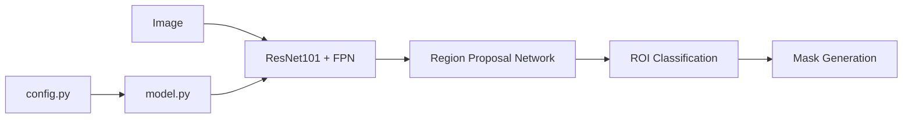

# matterport/Mask_RCNN

> Implémentation Keras/TensorFlow de Mask R-CNN pour la détection et la segmentation d'instances.

## Le problème
Segmenter chaque objet d'une image (boîte + masque) demande un pipeline RPN/ROI complexe à coder et déboguer.

## Ce que ça fait vraiment
Mask R-CNN sur FPN + ResNet101, avec poids pré-entraînés COCO et code d'entraînement/évaluation COCO.
Notebooks d'inspection étape par étape (ancres, raffinement de boîtes, masques, activations, poids).
Entraînement sur jeu personnel en sous-classant `Config` et `Dataset` ; `ParallelModel` pour multi-GPU.
Écarts documentés au papier (redimensionnement, boîtes calculées depuis les masques, learning rate).

## Comment c'est branché
Aucun composant lisible fourni par le diagramme ; schéma d'après le README :


## Essayer
```bash
pip3 install -r requirements.txt
python3 setup.py install
python3 samples/coco/coco.py train --dataset=/path/to/coco/ --model=coco
```

## Coût et pièges
Figé sur Python 3.4, TensorFlow 1.3, Keras 2.0.8 : incompatible avec les environnements actuels sans portage. pycocotools via des forks.

## Ce que ce n'est pas
Pas maintenu (dernier push 2024, 2 022 issues ouvertes). Pas compatible TF2 d'origine.

## Alternatives
Aucune alternative nommée dans le README.

## Pour toi
Ignorer pour un projet : pile TensorFlow 1 obsolète ; ne garder que les notebooks comme support pédagogique.
