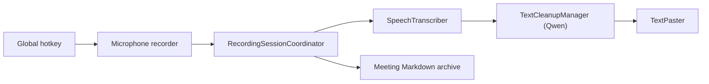

# matthartman/ghost-pepper

> Application macOS de dictée et de transcription de réunions qui tourne entièrement en local.

## Le problème
Les outils de dictée et de transcription envoient la voix à un cloud, avec abonnement et fuite de données.

## Ce que ça fait vraiment
On maintient Contrôle pour parler, puis le texte est collé dans le champ actif. Whisper, Parakeet, Qwen3-ASR ou Nemotron transcrivent en local ; un petit LLM Qwen nettoie le texte. Le mode réunion enregistre micro et son système, résume et écrit du Markdown. Des options cloud (Zo, Trello, Granola, Anthropic) sont désactivées par défaut.

## Comment c'est branché


## Essayer
```bash
# Télécharger GhostPepper.dmg, le glisser dans Applications
# Build : ouvrir GhostPepper.xcodeproj dans Xcode, puis Cmd+R
```
Accorder les permissions Micro et Accessibilité.

## Coût et pièges
Gratuit. Apple Silicon et macOS 14+ requis. Les modèles pèsent de 75 Mo à 2,8 Go. Aucune licence n'est déclarée : usage et redistribution incertains.

## Ce que ce n'est pas
Pas un service de transcription serveur. L'audit de confidentialité annoncé est fait par revue de code assistée par IA, pas par un tiers.

## Alternatives
Aucune alternative nommée dans le README.

## Pour toi
À surveiller si tu travailles sur macOS : bon exemple d'inférence locale, mais l'absence de licence bloque toute réutilisation.

