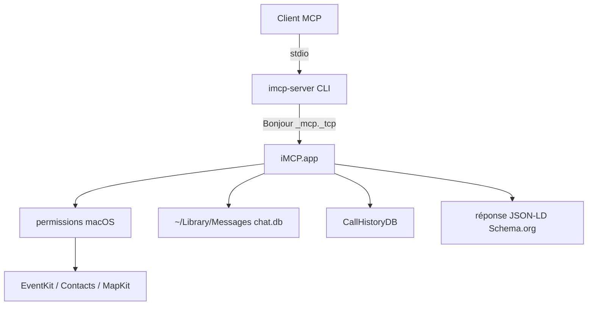

# mattt/iMCP

> Application macOS qui expose calendrier, contacts, messages et localisation aux clients MCP.

## Le problème
Un assistant IA ne sait rien de l'agenda, des contacts ou de l'historique d'appels de la machine sur laquelle il tourne.
Répondre suppose de recopier ces données à la main dans la conversation.

## Ce que ça fait vraiment
Expose neuf services — Calendrier, Contacts, Localisation, Cartes, Messages, Téléphone, Rappels, Raccourcis, Météo — comme outils MCP.
Chaque service s'active individuellement et déclenche la boîte de dialogue de permission macOS standard ; les icônes passent du gris à la couleur.
Les résultats sont renvoyés en JSON-LD adossé au vocabulaire Schema.org, via le paquet Swift `Ontology`.
Lit la base iMessage `chat.db`, en demandant l'accès au **dossier** `~/Library/Messages` pour couvrir le journal WAL, faute de quoi les messages récents manquent.

## Comment c'est branché


## Essayer
```bash
brew install --cask mattt/tap/iMCP
claude mcp add --scope user iMCP -- /Applications/iMCP.app/Contents/MacOS/imcp-server
npx @modelcontextprotocol/inspector [commande-copiée]
```

## Coût et pièges
macOS 15.3 minimum, donc du matériel Apple récent. Node.js seulement pour l'inspecteur de débogage.
iMCP ne collecte rien, mais le README précise que les clients comme Claude Desktop, eux, envoient les données hors de l'appareil.

## Ce que ce n'est pas
Pas multiplateforme : l'app repose sur les frameworks Apple et le bac à sable macOS.
Pas une API stable pour iMessage : Apple ne documente pas ce format, le décodage `typedstream` est du reverse-engineering repris d'`imessage-exporter`.
Un accès accordé au seul fichier `chat.db` par une version antérieure laisse les nouveaux messages invisibles jusqu'au prochain checkpoint.

## Alternatives
Aucune alternative nommée dans le README ; `Companion` et le MCP Inspector y sont cités comme outils de débogage, pas comme substituts.

## Pour toi
Sans objet hors écosystème Apple, et l'exposition de la base iMessage à un LLM distant demande une décision explicite.
