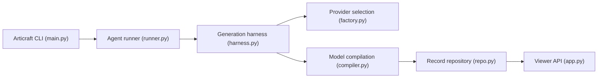

# mattzh72/articraft

> Génère des modèles 3D articulés à partir d'un prompt, avec visionneuse et SDK ; dépôt remplacé par un successeur.

## Le problème
Créer à la main des objets 3D avec articulations (charnières, bras) pour la simulation ou la robotique est long.

## Ce que ça fait vraiment
- `articraft generate` : un agent LLM écrit un `model.py` utilisant le SDK, le compile et enregistre l'enregistrement.
- `articraft fork` pour modifier un objet existant ; génération possible depuis une image.
- Visionneuse locale (API et frontend React, format URDF) ; jeu de données public `mattzh72/articraft-data`.
- Fournisseurs : OpenAI, Gemini, Anthropic, DashScope ; plafond de coût `--max-cost-usd`.

## Comment c'est branché


## Essayer
```bash
just setup
uv run articraft generate "Create a realistic articulated desk lamp with a weighted base, two hinged arms, and an adjustable lamp head."
uv run articraft fork <record_id> "make the handle longer"
just viewer
```

## Coût et pièges
Clés d'API de fournisseurs à ta charge. Python 3.12 recommandé, 3.13 et plus non supporté. Le code généré est exécuté : à ne lancer que depuis des sources de confiance. Le dépôt est indiqué comme remplacé par articraftresearch/Articraft.

## Ce que ce n'est pas
Pas un dépôt maintenu : le README renvoie vers le nouveau dépôt pour le développement actuel.

## Alternatives
Le README cite articraftresearch/Articraft, dépôt de remplacement.

## Pour toi
À surveiller via le dépôt successeur : idée intéressante d'agent générant du code 3D vérifiable, mais ce dépôt-ci n'est plus la source.

