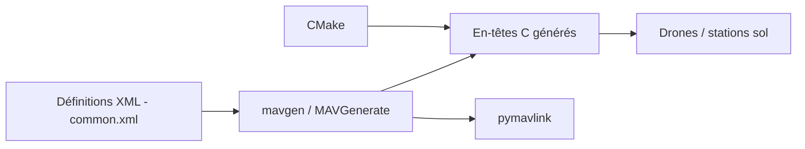

# mavlink/mavlink

> Protocole de messages léger pour drones et stations sol, avec générateur de code multilangage.

## Le problème
Des composants de constructeurs différents doivent échanger télémétrie et commandes sur des liaisons à faible débit.

## Ce que ça fait vraiment
Des définitions de messages en XML (« dialectes » comme `common.xml`) sont transformées par des outils Python (`pymavlink.tools.mavgen`) en bibliothèques dans plusieurs langages, dont des en-têtes C uniquement (header-only) optimisés pour peu de mémoire. Le protocole existe en versions 1.0 et 2.0. Le dépôt contient aussi des exemples C/C++, une intégration CMake et le système de documentation.

## Comment c'est branché


## Essayer
```bash
sudo apt install python3-pip
git clone https://github.com/mavlink/mavlink.git --recursive
cd mavlink
python3 -m pip install -r pymavlink/requirements.txt
python3 -m pymavlink.tools.mavgen --lang=C --wire-protocol=2.0 --output=generated/include/mavlink/v2.0 message_definitions/v1.0/common.xml
```

## Coût et pièges
Gratuit. Cloner avec `--recursive`. La licence est présente mais non identifiée par GitHub : lire le fichier LICENSE avant d'embarquer le code.

## Ce que ce n'est pas
Ce n'est pas un logiciel de pilotage ni un simulateur : c'est un format de messages et son générateur. Le dépôt ne fournit pas de station sol.

## Alternatives
Aucune alternative nommée dans le README.

## Pour toi
À surveiller : utile seulement si tu traites de la télémétrie de drones ou de robotique ; sinon hors périmètre, et la licence est à vérifier.

