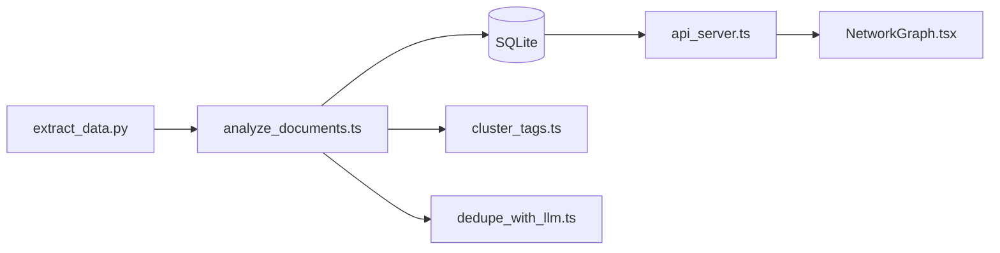

# maxandrews/Epstein-doc-explorer

> Pipeline Claude extrayant un graphe de relations de documents juridiques, avec explorateur web interactif.

## Le problème
Un corpus de milliers de documents est illisible sans extraction structurée des acteurs, actions et dates.

## Ce que ça fait vraiment
Extrait le texte des PDF, fait produire à Claude des triplets (acteur, action, cible, date, tags) stockés dans SQLite, regroupe ~28 000 tags en 30 clusters (K-means, embeddings Qwen3), dédoublonne les entités par LLM. Un serveur Express alimente une app React avec graphe de forces, timeline et visionneuse de documents.

## Comment c'est branché


## Essayer
```bash
npm install
cd network-ui && npm install && cd ..
npx tsx api_server.ts
cd network-ui && npm run dev
```

## Coût et pièges
L'analyse utilise l'API Anthropic (coût tracé en base). Il faut fournir les documents sources. Une base SQLite de 91 Mo est versionnée.

## Ce que ce n'est pas
Pas un outil vérifié : les relations sont extraites par LLM, donc sujettes à erreurs ; sujet sensible, à manier avec prudence. Dernier push nov. 2025.

## Alternatives
Aucune alternative citée dans le README.

## Pour toi
À surveiller comme exemple de pipeline LLM → graphe de connaissances, pas comme source factuelle.

