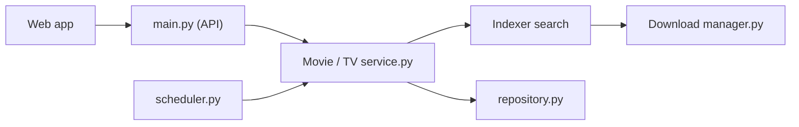

# maxdorninger/MediaManager

> Gestionnaire auto-hébergé de bibliothèque films et séries, alternative unifiée à la pile « Arr ».

## Le problème
Gérer séries, films, recherche d'indexeurs et téléchargements impose plusieurs outils distincts.

## Ce que ça fait vraiment
Interface web unique : recherche de métadonnées (TMDB, TVDB), recherche sur indexeurs, lancement de téléchargements via des clients torrent, importation, notifications et tâches planifiées. Authentification OAuth/OIDC. Flux films et séries séparés dans le backend.

## Comment c'est branché


## Essayer
```sh
wget -O docker-compose.yaml https://github.com/maxdorninger/MediaManager/releases/latest/download/docker-compose.yaml
mkdir config
wget -O ./config/config.toml https://github.com/maxdorninger/MediaManager/releases/latest/download/config.example.toml
docker compose up -d
```

## Coût et pièges
Docker et fichier config.toml à éditer. Il faut des indexeurs et clients de téléchargement ; le contenu récupéré relève de ta responsabilité légale.

## Ce que ce n'est pas
Pas un lecteur multimédia. Licence AGPL : obligations si tu proposes le service à des tiers.

## Alternatives
La pile « Arr », citée comme point de comparaison.

## Pour toi
Loisir domestique sans lien avec data/IA : ignorer.

