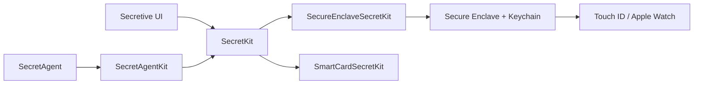

# maxgoedjen/secretive

> Application macOS qui stocke les clés SSH dans la Secure Enclave, pour développeurs sur Mac.

## Le problème
Une clé SSH sur disque peut être copiée par un logiciel malveillant ; les permissions de fichier seules ne suffisent pas.

## Ce que ça fait vraiment
Les clés sont créées dans la Secure Enclave et ne peuvent pas en être exportées. Elles peuvent exiger Touch ID ou Apple Watch avant chaque accès, et l'app notifie chaque usage. Un agent d'arrière-plan sert les clés à SSH, avec des bibliothèques Swift séparées pour la Secure Enclave et pour les cartes à puce (Macs plus anciens). Les builds sont produits par GitHub Actions avec attestation depuis la version 3.0.

## Comment c'est branché


## Essayer
```bash
brew install secretive
```
Sinon, télécharger la dernière version sur la page Releases.

## Coût et pièges
Gratuit. Les clés ne se sauvegardent pas et ne se transfèrent pas : sur un nouveau Mac, il faut en recréer. En compilant soi-même, garder le même bundle ID, sinon le Keychain ne retrouve pas les clés.

## Ce que ce n'est pas
Ce n'est pas un gestionnaire de secrets général, ni une solution multiplateforme : macOS uniquement. Ce n'est pas non plus un coffre partageable en équipe.

## Alternatives
Le README cite sekey comme source d'inspiration ; il ne le présente pas comme alternative à privilégier.

## Pour toi
Adopter si tu te connectes en SSH à des serveurs GPU ou de déploiement depuis un Mac : la clé ne peut plus fuiter par copie de fichier, pour un coût d'installation minime.

