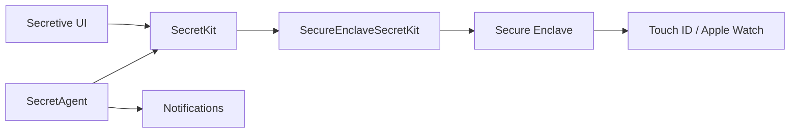

# maxgoedjen/secretive

> Application macOS qui protège les clés SSH dans le Secure Enclave, avec Touch ID, pour les utilisateurs de Mac.

## Le problème
Des clés SSH stockées sur disque peuvent être copiées par un logiciel malveillant.

## Ce que ça fait vraiment
Crée des clés dans le Secure Enclave, non exportables par conception, et exige Touch ID ou Apple Watch avant chaque usage. Un agent en arrière-plan sert les clés au client SSH et une notification signale chaque accès. Des paquets Swift séparent Secure Enclave et cartes à puce. Les versions sont construites par GitHub Actions avec attestation d'artefact depuis la 3.0.

## Comment c'est branché


## Essayer
```bash
brew install secretive
```

## Coût et pièges
Gratuit. Les clés ne se sauvegardent pas et ne se transfèrent pas : il faut en recréer sur un nouveau Mac. Compiler soi-même demande un identifiant de bundle cohérent pour retrouver les clés dans le trousseau.

## Ce que ce n'est pas
Pas un gestionnaire de mots de passe ni une solution multi-plateformes : macOS uniquement.

## Alternatives
sekey, cité comme source d'inspiration.

## Pour toi
À surveiller si tu travailles sur Mac et te connectes à des serveurs GPU ou à Git en SSH : sécurise tes clés simplement, sans effet sur les pipelines.

