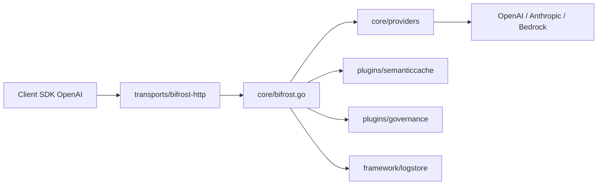

# maximhq/bifrost

> Passerelle Go qui expose 23+ fournisseurs de LLM derrière une seule API compatible OpenAI.

## Le problème
Chaque fournisseur a son SDK, ses clés, ses pannes. Basculer d'OpenAI vers Anthropic ou Bedrock
demande de réécrire le code d'appel et de gérer soi-même quotas, reprises et budgets.

## Ce que ça fait vraiment
Un seul endpoint `/v1/chat/completions` routé vers OpenAI, Anthropic, Bedrock, Vertex, Azure,
Cohere, Mistral, Ollama, Groq et d'autres. Bascule automatique entre fournisseurs et clés,
cache sémantique, passerelle MCP pour outiller les modèles, suivi d'usage, limites de débit et
budgets hiérarchiques. Interface web intégrée pour configurer sans fichier, métriques Prometheus.

## Comment c'est branché


## Essayer
```bash
npx -y @maximhq/bifrost
docker run -p 8080:8080 -v $(pwd)/data:/app/data maximhq/bifrost
curl -X POST http://localhost:8080/v1/chat/completions \
  -H "Content-Type: application/json" \
  -d '{"model": "openai/gpt-4o-mini", "messages": [{"role": "user", "content": "Hello, Bifrost!"}]}'
go get github.com/maximhq/bifrost/core
```

## Coût et pièges
Le binaire est gratuit mais les clés des fournisseurs restent à ta charge, et la facture de
tokens ne bouge pas. Load balancing adaptatif, clustering, garde-fous et passerelle MCP sont
réservés aux déploiements « enterprise » : le README ne dit pas ce qui est ouvert.

## Ce que ce n'est pas
Ce n'est pas un fournisseur d'inférence : sans clés, rien ne répond. Ce n'est pas un framework
d'agents — pas d'orchestration, pas de mémoire. Les chiffres de surcoût (11 µs à 5 000 RPS)
sont ceux de l'éditeur, mesurés sur ses propres instances t3.

## Alternatives
- **LiteLLM** : cité comme SDK intégré ; couche Python plus légère si tu restes en Python.
- **LangChain** : cité comme intégration ; à préférer si tu veux la chaîne complète, pas la passerelle.

## Pour toi
Utile si tu multiplies les fournisseurs en production ; surdimensionné pour un seul modèle.
