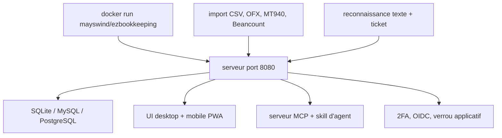

# mayswind/ezbookkeeping

> Application de comptabilité personnelle auto-hébergée, légère, avec import multi-formats.

## Le problème
Les applications de finances personnelles sont soit cloud, soit lourdes, soit incapables d'avaler les formats bancaires historiques.
Analyser ses dépenses suppose d'exporter vers un tableur.

## Ce que ça fait vraiment
Elle enregistre les transactions avec comptes et catégories sur deux niveaux, pièces jointes images, géolocalisation sur carte et transactions planifiées.
L'import couvre CSV, Excel, OFX, QFX, QIF, IIF, Camt.052, Camt.053, MT940, GnuCash, Firefly III et Beancount, avec mapping de colonnes, règles et scripts personnalisés.
L'analyse passe par des graphiques intégrés ou des requêtes personnalisées avec tes propres dimensions ; l'UI est distincte sur mobile et bureau, installable en PWA.
Côté IA : reconnaissance de texte et de tickets en image, serveur MCP, skill d'agent et scripts CLI pour l'intégration.

## Comment c'est branché


## Essayer
```bash
docker run -p8080:8080 mayswind/ezbookkeeping
./build.sh package -o ezbookkeeping.tar.gz
./build.sh docker
```

## Coût et pièges
Gratuit et frugal : le README revendique un fonctionnement sur NAS et Raspberry Pi, x86, amd64 et ARM.
Piège documenté : en production il faut monter un volume persistant au démarrage du conteneur, sinon les données disparaissent.

## Ce que ce n'est pas
Ce n'est pas un outil d'entreprise : c'est de la comptabilité personnelle, sans multi-entité ni écritures comptables normées.
Les fonctions IA sont annoncées mais non détaillées dans le README — aucun fournisseur, aucune clé, aucun coût indiqué.

## Alternatives
- GnuCash, Firefly III, Beancount : cités comme formats d'import, donc comme les outils dont on migre.

## Pour toi
Hors périmètre professionnel ; à noter seulement pour l'idée d'un serveur MCP posé sur ses propres données personnelles.
