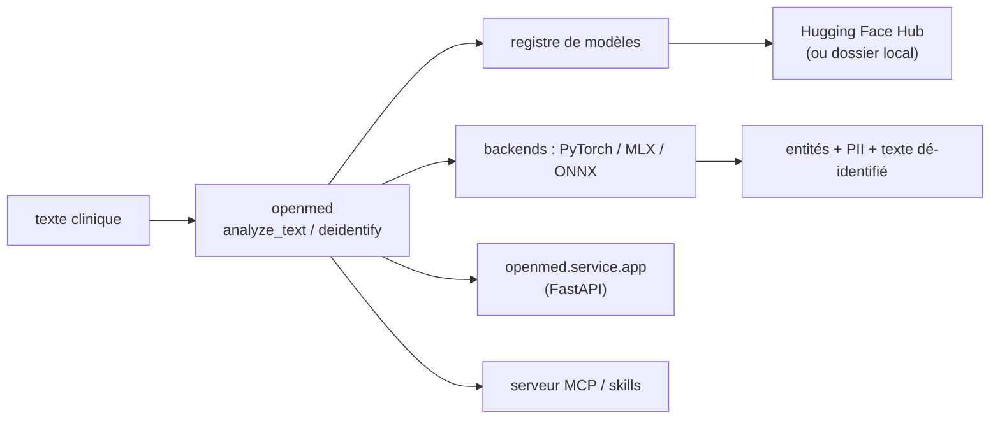

# maziyarpanahi/openmed

> SDK local d'extraction d'entités cliniques et de dé-identification de données de santé, multi-backend.

## Le problème
Envoyer des notes cliniques à une API cloud pour en extraire maladies, médicaments ou identifiants
est rarement acceptable ; recoller soi-même modèles NER médicaux, tokenizer et règles PII est long.

## Ce que ça fait vraiment
`analyze_text()` renvoie des entités typées (DISEASE, DRUG, ANATOMY, GENE…) depuis un registre de
modèles spécialisés ; `extract_pii()` et `deidentify()` couvrent masquage, remplacement, hachage et
décalage de dates, avec une fusion d'entités qui garde `01/15/1970` entier. Le même code tourne sur
CPU, CUDA, MLX (Apple Silicon), ONNX Runtime Mobile (Android) et Transformers.js (navigateur/WebGPU).
Un service FastAPI expose `/analyze`, `/pii/extract`, `/pii/deidentify`, plus un serveur MCP et un
catalogue de skills agent installables.

## Comment c'est branché


## Essayer
```bash
pip install --upgrade "openmed[hf]"
pip install --upgrade "openmed[hf,service]"
pip install --upgrade "openmed[mlx]"
uvicorn openmed.service.app:app --host 0.0.0.0 --port 8080
curl -X POST http://127.0.0.1:8080/pii/extract \
  -H "Content-Type: application/json" \
  -d '{"text":"Paciente: Maria Garcia, DNI: 12345678Z","lang":"es"}'
./install-skills.sh
```

## Coût et pièges
Le SDK est Apache-2.0, mais chaque modèle et dataset a ses propres conditions, à valider soi-même.
Modèles de 109M à 434M paramètres à télécharger ; des chemins réseau (téléchargement, adaptateurs
distants, télémétrie) existent et sont à couper explicitement pour un usage hors ligne.

## Ce que ce n'est pas
Pas une conformité HIPAA : le README répète que l'alignement « Safe Harbor » est une aide, que la
revue de déploiement par un expert reste obligatoire et que l'usage du SDK ne l'établit pas. Pas un
modèle de génération : c'est de la classification de tokens, pas un LLM clinique.

## Alternatives
- `transformers` + un modèle NER (p. ex. `dslim/bert-base-NER`) : moins de plomberie, tout à écrire.
- `openai/privacy-filter` seul : les poids sans la couche de politiques ni le service.
- Transformers.js : si le besoin est uniquement navigateur.

## Pour toi
La référence à tester si tu touches à de la donnée de santé : dé-identification locale, API sobre.
