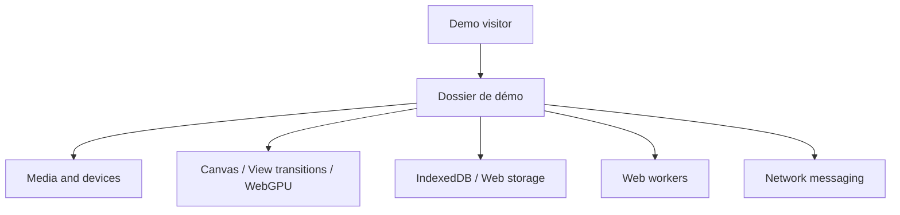

# mdn/dom-examples

> Exemples de code autonomes accompagnant la documentation MDN sur les API DOM et Web.

## Le problème
Certaines démonstrations d'API web ne tiennent pas dans une page MDN, pour des raisons techniques ou de sécurité.

## Ce que ça fait vraiment
Un répertoire par démo : Abort API, canvas, Web Workers, WebGL, WebGPU (calcul et rendu), IndexedDB, Service Worker, View Transitions, Streams, WebXR, notifications, etc. Chaque démo est indépendante, sans orchestrateur commun, et la plupart ont un lien « live ».

## Comment c'est branché


## Essayer
```bash
# Aucune commande générale : ouvrir les liens « live » du README ; le démo SSE demande un serveur PHP.
```

## Coût et pièges
Gratuit. Les exemples ne sont pas des bibliothèques à installer. La plupart nécessitent un navigateur récent pour les API expérimentales.

## Ce que ce n'est pas
Pas une application ni un framework : une collection de démos indépendantes.

## Alternatives
Aucune alternative nommée dans le README (le README préfère les exemples directement dans MDN quand c'est possible).

## Pour toi
À surveiller : référence pratique si tu construis des interfaces web pour tes modèles (WebGPU, Workers, Streams), sans valeur au-delà.

