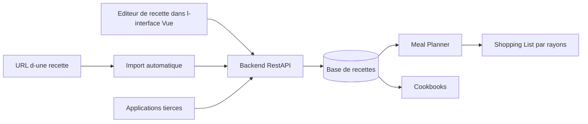

# mealie-recipes/mealie

> **Self-hosted recipe manager for a household, with meal planning and shopping lists.**

## The problem

Without it, recipes stay scattered across web pages, screenshots and paper notebooks, and nothing
connects what you plan to cook this week with what you have to buy at the shop. The README states
no motivation beyond that domestic need.

## What it actually does

Mealie is a self-hosted recipe manager, meal planner and shopping list. It imports a recipe **from
a URL**, pulling the relevant data automatically, or lets you type a family recipe into the UI
editor. Recipes can be grouped into cookbooks on your own criteria, and shopping-list ingredients
are organised into sections matching your local supermarket. It exposes a REST API for third-party
applications, and the interface is translated into 35+ languages through Crowdin. The README does
not document the data model or the parsing internals.

## How it is wired



Inferred from the README alone: two entry paths — URL import and the reactive Vue editor — feed a
REST backend that stores recipes. From that store come the meal planner, which pushes ingredients
into the section-organised shopping list, and the cookbooks. The same API is the entry point for
third-party apps. The README names no internal file or component.

## Trying it

```bash
# No installation command is documented in the README.
```

The README advertises easy Docker deployment and links to the GitHub Container Registry and the
`hkotel/mealie` Docker Hub image, but contains no copyable `docker run` or `docker compose`.
Everything points to the external docs at `docs.mealie.io`, with a public demo at `demo.mealie.io`.
Nothing is reconstructed here.

## Cost and traps

The code is free, but this is self-hosting: your own machine, Docker, and the ongoing chore of
backups and upgrades. The README specifies neither the required database, nor RAM, nor environment
variables. The AGPL license is contaminating as soon as you expose a modified service over a
network. The project asks for financial contributions (GitHub Sponsors, Buy Me a Coffee), a sign it
leans heavily on one main author. Translations go through Crowdin, a third-party service.

## What it is not

Not a SaaS: nothing is hosted for you apart from the demo, and there is no managed account. Not a
recipe database shipped with content — it stores what you add or import. Not a nutrition or calorie
tracker either: the README mentions no dietary analysis, no automatic suggestions and no AI parts.

## Alternatives

No comparable alternative in the catalogue: the README names no competing project, and the supplied
neighbours (usememos/memos, go-gitea/gitea, gogs/gogs, Flagsmith/flagsmith) share only the
self-hosted-service nature, not the purpose. Comparing them here would be stretching the point.

## For you

Unrelated to data, AI or MLOps: treat it as one more domestic service in a homelab, not a work
tool. The single professional angle is its REST API, a convenient playground for scraping or a
chat agent, but that is a pretext. Skip it if your self-hosted stack is already crowded.
