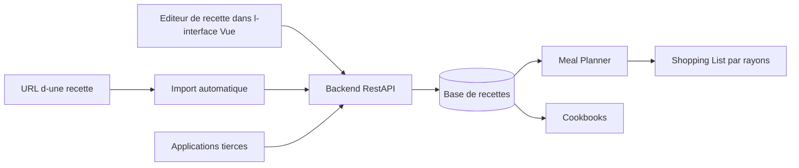

# mealie-recipes/mealie

> **Gestionnaire de recettes auto-hébergé pour une famille, avec planning de repas et liste de courses.**

## Le problème

Sans lui, les recettes restent éparpillées entre pages web, captures d'écran et carnets papier,
et rien ne relie ce qu'on veut cuisiner cette semaine à ce qu'il faut acheter au supermarché.
Le README ne détaille pas d'autre motivation que ce besoin domestique.

## Ce que ça fait vraiment

Mealie est un gestionnaire de recettes auto-hébergé, doublé d'un planificateur de repas et d'une
liste de courses. Il importe une recette **à partir d'une URL** en récupérant automatiquement les
données pertinentes, ou laisse saisir une recette de famille via l'éditeur de l'interface.
Il regroupe les recettes en « cookbooks » selon des critères choisis par l'utilisateur, et organise
les ingrédients de la liste de courses en rayons correspondant au supermarché local.
Il expose une API REST destinée aux applications tierces, et l'interface est traduite dans plus de
35 langues via Crowdin. Le README ne documente pas le détail du modèle de données ni du parsing.

## Comment c'est branché



Diagramme déduit du seul README : deux voies d'entrée — l'import depuis une URL et l'éditeur de
l'interface réactive écrite en Vue — alimentent un backend REST qui stocke les recettes. Depuis ce
stock partent le planificateur de repas, qui déverse ses ingrédients dans la liste de courses
organisée par sections de magasin, et les cookbooks. La même API sert de point d'entrée aux
applications tierces. Le README ne nomme aucun fichier ni composant interne.

## Essayer

```bash
# Aucune commande d'installation n'est documentée dans le README.
```

Le README annonce un déploiement Docker « facile » et pointe vers le GitHub Container Registry et
le Docker Hub `hkotel/mealie`, mais ne contient ni `docker run` ni `docker compose` copiable. Tout
renvoie à la documentation externe `docs.mealie.io`, et une démo publique existe sur
`demo.mealie.io`. Rien n'est reconstruit ici.

## Coût et pièges

Le code est gratuit, mais c'est de l'auto-hébergement : il faut une machine à soi, Docker, et
accepter d'administrer la base dans la durée (sauvegardes, montées de version). Le README ne
précise ni la base de données requise, ni la RAM, ni les variables d'environnement. La licence
AGPL est contaminante dès qu'on expose un service modifié sur le réseau. Le projet sollicite des
contributions financières (GitHub Sponsors, Buy Me a Coffee), signe qu'il repose largement sur un
auteur principal. Le versement des traductions passe par Crowdin, un service tiers.

## Ce que ce n'est pas

Ce n'est pas un SaaS : rien n'est hébergé pour toi hors la démo, et aucun compte géré n'existe.
Ce n'est pas une base de recettes livrée avec du contenu — l'outil stocke ce que tu y mets ou
importes. Ce n'est pas non plus un outil nutritionnel ou de suivi de calories : le README ne
mentionne aucune analyse diététique, aucune suggestion automatique ni composant d'IA.

## Alternatives

Aucune alternative comparable dans le catalogue : le README ne cite aucun projet concurrent, et les
voisins proposés (usememos/memos, go-gitea/gitea, gogs/gogs, Flagsmith/flagsmith) ne partagent avec
Mealie que la nature de service auto-hébergé, pas l'objet. Les comparer ici serait forcer le trait.

## Pour toi

Sans rapport avec la data, l'IA ou le MLOps : à traiter comme un service domestique de plus dans un
homelab, pas comme un outil de travail. L'unique angle professionnel est son API REST, terrain
d'essai commode pour du scraping ou un agent conversationnel, mais c'est un prétexte. Passe ton
chemin si ta stack self-hosted est déjà chargée.
