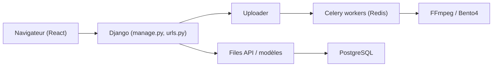

# mediacms-io/mediacms

> CMS vidéo et média auto-hébergé, construit avec Django et React, pour portails internes ou éducatifs.

## Le problème
Héberger et partager vidéos, audios, images et PDF sans les confier à une plateforme externe.

## Ce que ça fait vraiment
Application Django et API REST : envoi fractionné et reprenable, transcodage asynchrone via Celery (FFmpeg, Bento4, profils 144p à 1080p, HLS), sous-titres, transcription locale avec Whisper, découpage vidéo, listes de lecture, droits par rôle (RBAC), SAML, LTI 1.3, plugin Moodle. PostgreSQL, Redis, Nginx, Gunicorn.

## Comment c'est branché


## Essayer
```bash
# Aucune commande précise dans le README : passer par la page « Docker Compose »
# de la documentation ou par le script d'installation sur serveur.
```

## Coût et pièges
Gratuit. Minimum conseillé : 4 Go de RAM et 2 à 4 CPU ; disque à compter trois fois le volume envoyé ; plus de CPU pour Whisper. Licence AGPL-3.0. Les auteurs proposent aussi des prestations payantes.

## Ce que ce n'est pas
Pas un service de diffusion à grande échelle : le README vise petites et moyennes installations.

## Alternatives
Aucune alternative nommée dans le README.

## Pour toi
À surveiller : pertinent pour archiver des vidéos de formation ou de démonstration en interne, avec transcription locale ; lourd pour un usage occasionnel.

