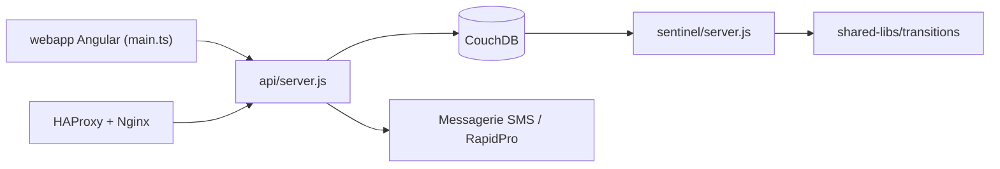

# medic/cht-core

> Framework de santé communautaire hors ligne pour bâtir des applications de terrain pour agents de santé.

## Le problème
Les agents de santé communautaires travaillent souvent sans connexion, avec des hiérarchies et des flux de rapports propres à chaque programme.

## Ce que ça fait vraiment
Architecture multiservice : client Angular hors ligne (contacts, rapports, tâches, messages), API Node.js, CouchDB comme source de vérité, et Sentinel, un worker qui applique des règles de transition (enregistrements, alertes, rappels). Formulaires XForms via Enketo, SMS (Africa's Talking, RapidPro), configurations de programme déployables. Installation en Docker ou Kubernetes.

## Comment c'est branché

## Essayer
Le README ne donne pas de commande : il renvoie aux instructions de déploiement facile (Docker) et à `cht-conf` pour configurer.

## Coût et pièges
Déploiement multiservice, avec CouchDB à exploiter ; passerelles SMS externes pour la messagerie. 655 issues ouvertes.

## Ce que ce n'est pas
Ce n'est pas une application clé en main : on construit son application avec le framework et `cht-conf`.

## Alternatives
Le README ne cite aucune alternative.

## Pour toi
À ignorer : plateforme de santé communautaire lourde, sans rapport avec le quotidien data/IA/MLOps, sauf projet de santé numérique dédié.

