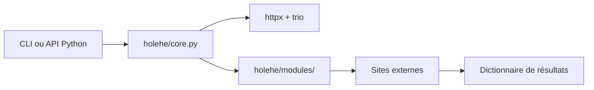

# megadose/holehe

> Outil OSINT qui teste si une adresse e-mail est inscrite sur plus de 120 sites.

## Le problème
Savoir sur quels services en ligne une adresse e-mail possède un compte, sans les tester un par un.

## Ce que ça fait vraiment
Pour chaque site, un module envoie des requêtes (inscription, connexion ou récupération de mot de passe) et renvoie un dictionnaire : nom, limite de débit, existence du compte, e-mail ou téléphone de récupération partiellement masqués. Le moteur (`core.py`) appelle les modules en parallèle avec `httpx` et `trio`. Le README affirme ne pas alerter l'adresse ciblée.

## Comment c'est branché


## Essayer
```bash
pip3 install holehe
holehe test@gmail.com
docker build . -t my-holehe-image
docker run my-holehe-image holehe test@gmail.com
```

## Coût et pièges
Gratuit, mais les sites limitent le débit (« change ton IP », dit le README). Dernier push en septembre 2024 : les modules dépendent de pages tierces qui changent, donc des résultats faux ou cassés sont probables. GPL-3.0 : contrainte de redistribution.

## Ce que ce n'est pas
Ce n'est pas un outil de vérification d'identité. Interroger les comptes d'une personne sans son accord pose un problème de protection des données.

## Alternatives
Le README remercie `socialscan` et `UhOh365` comme sources d'inspiration ; il propose aussi une transformation Maltego (`holehe-maltego`).

## Pour toi
Ignorer : outil OSINT hors profil data/IA, non maintenu depuis plus d'un an, aux implications de vie privée délicates.

