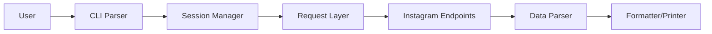

# megadose/toutatis

> Ligne de commande qui extrait e-mails, téléphones et statistiques de comptes Instagram, pour l'OSINT.

## Le problème
Le profil public d'un compte Instagram n'affiche pas ses coordonnées de contact. Ce script interroge Instagram pour en récupérer des versions publiques ou masquées.

## Ce que ça fait vraiment
À partir d'un nom d'utilisateur ou d'un identifiant, plus le cookie `sessionid` d'une session Instagram connectée, l'outil affiche dans le terminal : nom, abonnés, nombre de publications, URL externe, biographie, e-mail et téléphone publics, versions masquées de l'e-mail et du téléphone, et l'URL de la photo de profil. Le code tient dans un paquet `toutatis` (`core.py`) : analyse des arguments, requête HTTPS, extraction, affichage.

## Comment c'est branché


## Essayer
```bash
pip install toutatis
toutatis -u username -s instagramsessionid
toutatis -i instagramID -s instagramsessionid
```

## Coût et pièges
Gratuit, mais il faut un cookie de session Instagram valide, donc un compte connecté. Le README ne dit pas ce que devient ce compte face aux règles d'Instagram. Dernier push en décembre 2024, 347 issues ouvertes : les points d'accès ciblés ont pu évoluer.

## Ce que ce n'est pas
Ce n'est pas un outil de données ou d'analyse au sens propre : c'est un extracteur de coordonnées de personnes. Son usage sur des comptes tiers soulève des questions de CGU et de RGPD que le README n'aborde pas. La licence GPL-3.0 est copyleft, et le README affiche une adresse de dons BTC.

## Alternatives
Aucune alternative citée dans le README.

## Pour toi
À ignorer : hors de ton périmètre data, IA et MLOps, dépendant d'une session Instagram personnelle, non maintenu depuis fin 2024, et d'un usage juridiquement délicat.
