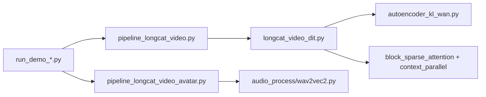

# meituan-longcat/LongCat-Video

> Modèle de génération vidéo de 13,6 milliards de paramètres (texte, image, continuation), avec une variante avatar pilotée par l'audio.

## Le problème
Les modèles vidéo ouverts génèrent surtout des clips courts. LongCat-Video vise des vidéos longues, sans dérive de couleur ni perte de qualité.

## Ce que ça fait vraiment
Un seul modèle traite texte-vers-vidéo, image-vers-vidéo et continuation de vidéo. Le dépôt contient uniquement l'inférence et des démos, pas l'entraînement : un backbone DiT, un autoencodeur vidéo, un échantillonnage flow-matching, de l'attention block-sparse et du context parallel multi-GPU. Une branche Avatar ajoute l'audio (wav2vec2, puis Whisper-large-v3 pour la 1.5).

## Comment c'est branché


## Essayer
```bash
conda create -n longcat-video python=3.10
conda activate longcat-video
pip install -r requirements.txt
huggingface-cli download meituan-longcat/LongCat-Video --local-dir ./weights/LongCat-Video
torchrun run_demo_text_to_video.py --checkpoint_dir=./weights/LongCat-Video --enable_compile
```

## Coût et pièges
GPU obligatoire, torch 2.6 + CUDA 12.4 et flash-attn à compiler. Poids à télécharger depuis Hugging Face. VRAM nécessaire non chiffrée dans le README.

## Ce que ce n'est pas
Pas un service prêt à l'emploi ni un outil d'entraînement. Les scores MOS viennent d'un benchmark interne : en image-vers-vidéo, le modèle est sous Wan 2.2 sur la qualité globale (3,17 contre 3,26). Les avertissements d'usage restent à la charge de l'utilisateur.

## Alternatives
- Wan 2.2 (T2V/I2V-A14B) : ouvert aussi, MoE de 28B, meilleur score global en image-vers-vidéo.
- Veo3 : propriétaire, meilleur alignement texte dans leur comparaison.

## Pour toi
À surveiller : modèle vidéo sous MIT, activement mis à jour, mais il exige un GPU lourd et ne décolle que pour qui fait de la génération vidéo.

