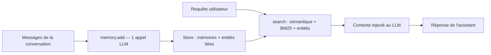

# mem0ai/mem0

> Couche de mémoire pour assistants et agents : retenir les préférences d'un utilisateur entre sessions.

## Le problème
Un agent repart de zéro à chaque conversation. Recoller le contexte à la main gonfle le prompt et coûte des tokens sans garantie de pertinence.

## Ce que ça fait vraiment
Stocke et retrouve des mémoires aux niveaux utilisateur, session et agent. Le nouvel algorithme (avril 2026) fait une extraction ADD-only en un appel LLM, sans UPDATE ni DELETE : les mémoires s'accumulent. Les entités sont extraites, embarquées et liées entre mémoires ; la recherche fusionne sémantique, BM25 et correspondance d'entités, avec un raisonnement temporel. Trois formes : bibliothèque pip/npm, serveur auto-hébergé Docker, plateforme cloud.

## Comment c'est branché


## Essayer
```bash
pip install mem0ai
pip install mem0ai[nlp] && python -m spacy download en_core_web_sm
cd server && make bootstrap
```

## Coût et pièges
Mem0 exige un LLM, `gpt-5-mini` par défaut, et `text-embedding-3-small` : clé d'API OpenAI à ta charge. Les chiffres de benchmark annoncés valent pour la plateforme gérée, qui contient des optimisations propriétaires absentes du SDK open source. L'auth du serveur auto-hébergé est activée par défaut.

## Ce que ce n'est pas
Ce n'est pas une base vectorielle : c'est une couche au-dessus. Les scores publiés ne sont pas reproductibles tels quels en open source. La mémoire n'est pas gratuite en tokens : ~7 K tokens par récupération annoncés.

## Alternatives
- Qdrant hébergé : si tu as déjà tes vecteurs, un guide de migration existe.
- Langgraph, CrewAI : intégrations citées, pour l'orchestration plutôt que la mémoire.

## Pour toi
À surveiller : la version open source est utilisable, mais compare-la à une solution locale avant de dépendre du cloud.
