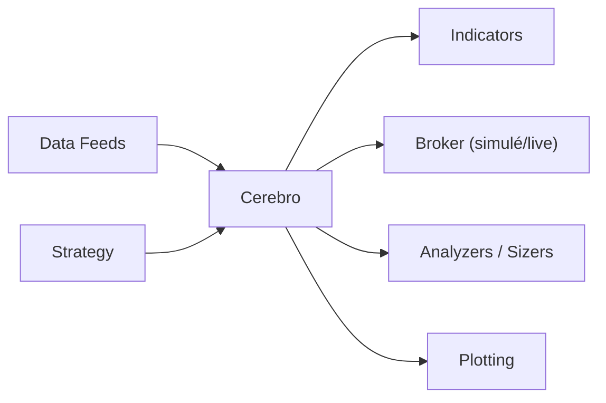

# mementum/backtrader

> Plateforme Python de backtesting et de trading en direct, pour stratégies de trading algorithmique.

## Le problème
Tester une stratégie de trading sur des données historiques, puis la passer en réel, demande de construire soi-même simulateur de courtier, indicateurs et graphiques.

## Ce que ça fait vraiment
Moteur `Cerebro` qui exécute une ou plusieurs stratégies sur plusieurs flux de données et plusieurs périodes : 122 indicateurs intégrés (plus TA-Lib), analyseurs (Sharpe, SQN), courtier simulé (ordres marché, limite, stop, OCO, commissions, glissement), tailles de position, filtres, rééchantillonnage, graphiques matplotlib. Trading en direct via Interactive Brokers, Visual Chart, Oanda. Le README indique Python ≥ 3.2 et aucune dépendance hors tracé.

## Comment c'est branché


## Essayer
```bash
pip install backtrader
pip install backtrader[plotting]
```

## Coût et pièges
Gratuit ; le trading réel passe par un courtier tiers. GPL-3.0. Dernier push en 2024-08 (plus d'un an). L'intégration Yahoo dépend d'une API tierce dont le README note l'instabilité, et pyfolio est marqué obsolète.

## Ce que ce n'est pas
Ce n'est pas une garantie de rentabilité : un bon backtest ne dit rien du futur. Les tickets ne servent plus au support.

## Alternatives
Aucune alternative nommée dans le README.

## Pour toi
Surveiller : cadre pratique pour du backtesting en Python, mais peu actif ; à comparer à des outils récents avant de s'y engager.

