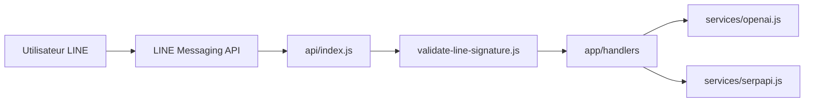

# memochou1993/gpt-ai-assistant

> Bot de chat LINE branché sur l'API OpenAI, déployable sur Vercel (fiche minimale).

## Le problème
Discuter avec un assistant GPT depuis l'application LINE, sans écrire le webhook soi-même.

## Ce que ça fait vraiment
D'après le code : `api/index.js` reçoit le webhook LINE et vérifie sa signature.
Un pipeline handlers → commandes → actions, qui appelle OpenAI (chat, image, transcription).
SerpAPI en option pour la recherche web.
Hébergement sur Vercel ou en Docker.

## Comment c'est branché

## Essayer
Aucune commande documentée dans le README (renvoi vers une doc externe).

## Coût et pièges
Clé OpenAI et compte LINE Developers nécessaires.

## Ce que ce n'est pas
Pas maintenu comme projet principal : l'auteur renvoie vers « fermi », son successeur.

## Alternatives
- fermi : successeur désigné (Supabase + OpenRouter).

## Pour toi
À ignorer : c'est un bot LINE grand public, déjà remplacé par son auteur, et il n'apporte rien à un profil data ou MLOps.
