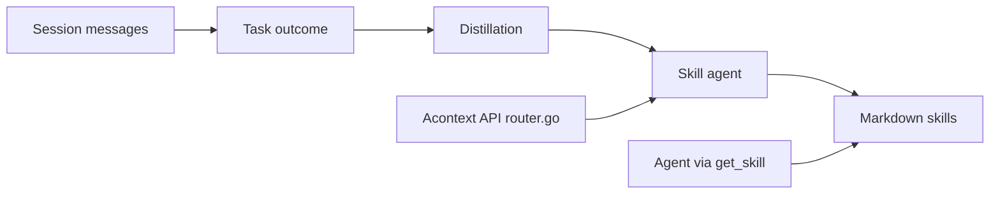

# memodb-io/Acontext

> Couche de mémoire pour agents IA qui stocke les apprentissages sous forme de fichiers Markdown de skills.

## Le problème
La mémoire d'agent est opaque, difficile à déboguer et à corriger par l'utilisateur.

## Ce que ça fait vraiment
Les messages de session alimentent une distillation par LLM quand une tâche se termine ou échoue ; un agent « Skill » écrit alors dans des fichiers de skills (schéma `SKILL.md` défini par toi). À la relecture, l'agent appelle `get_skill` / `get_skill_file` : divulgation progressive, pas de recherche sémantique. Export en ZIP possible. Option cloud ou auto-hébergement.

## Comment c'est branché


## Essayer
```bash
curl -fsSL https://install.acontext.io | sh
mkdir acontext_server && cd acontext_server
acontext server up
pip install acontext
```

## Coût et pièges
Auto-hébergement : Docker et une clé OpenAI (modèle par défaut `gpt-4.1`) ; dépendances PostgreSQL, S3, Redis, RabbitMQ. Le cloud demande une clé `sk-ac`, crédits gratuits au départ.

## Ce que ce n'est pas
Pas une base vectorielle : le rappel passe par les outils et le raisonnement de l'agent. Mémoire fiable seulement si tes outils d'agent savent appeler les skills.

## Alternatives
Aucune alternative nommée dans le README.

## Pour toi
À surveiller : idée intéressante (mémoire lisible et versionnable) mais pile lourde à auto-héberger ; teste d'abord via le cloud.

