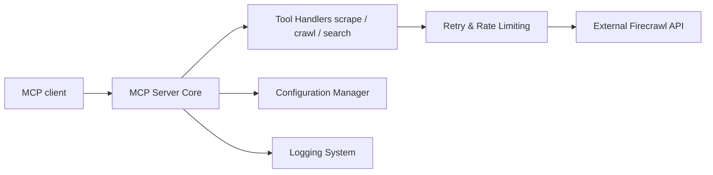

# mendableai/firecrawl-mcp-server

> Serveur MCP donnant aux agents la recherche web, le scraping et l'interaction avec des pages via Firecrawl.

## Le problème
Un agent a besoin de pages web propres, structurées et à jour, pas du HTML brut.

## Ce que ça fait vraiment
Outils MCP : scrape (JSON avec schéma ou markdown), map, crawl, search, parse de fichiers, interact (clics), agent de recherche autonome asynchrone, monitor de changements, recherche pour développeurs et recherche de papiers. Point d'accès hébergé sans clé (scrape, search, parse limités en débit), OAuth ou clé pour le reste. Auto-hébergement possible via `FIRECRAWL_API_URL`.

## Comment c'est branché


## Essayer
```bash
env FIRECRAWL_API_KEY=fc-YOUR_API_KEY npx -y firecrawl-mcp
```

## Coût et pièges
Crédits Firecrawl consommés par appel (search : 2 crédits). Les outils crawl, map et agent exigent une clé. Le crawl peut saturer le contexte : borner limit et profondeur. Outils de feedback actifs par défaut (désactivables).

## Ce que ce n'est pas
Pas un navigateur piloté pas à pas : chaque appel interact termine son tour avant de rendre la main. Le dépôt cité est passé sous l'organisation firecrawl.

## Alternatives
- Aucune alternative nommée dans le README.

## Pour toi
À adopter pour donner des capacités web à un agent en quelques lignes ; coût lié aux crédits Firecrawl et données envoyées à un tiers.
