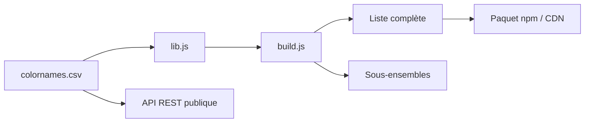

# meodai/color-names

> Liste curée de plus de 31 900 noms de couleurs avec valeurs hex, en plusieurs formats et via une API.

## Le problème
Associer un nom lisible à une couleur exige une liste fiable, sans doublons ni noms offensants.

## Ce que ça fait vraiment
Un fichier CSV central alimente un script de build qui produit JSON, CSV, YAML, XML, SCSS et d'autres, en trois jeux : complet, « best of » et noms courts. Paquet npm `color-name-list` et API REST publique (api.color.pizza). Les noms sont sélectionnés par des humains, avec une politique contre les noms générés par IA.

## Comment c'est branché


## Essayer
```bash
npm install color-name-list
npm install && npm run build
```
```javascript
import { colornames } from 'color-name-list';
const white = colornames.find((c) => c.hex === '#ffffff');
```

## Coût et pièges
Gratuit ; l'API n'a pas de limite, mais un trafic commercial excessif peut valoir une demande de sponsoring. Paquet complet : 1,22 Mo, donc l'API ou un sous-ensemble pour le navigateur.

## Ce que ce n'est pas
Pas un outil de sélection de couleur : l'API ne renvoie que le nom le plus proche. Le code de l'API et des outils de recherche n'est pas dans ce dépôt.

## Alternatives
Aucune citée dans le README (sources fusionnées : xkcd, ntc.js, Wikipedia).

## Pour toi
Utile pour étiqueter des couleurs en dataviz ou en jeu de données ; licence MIT permissive : adopter.

