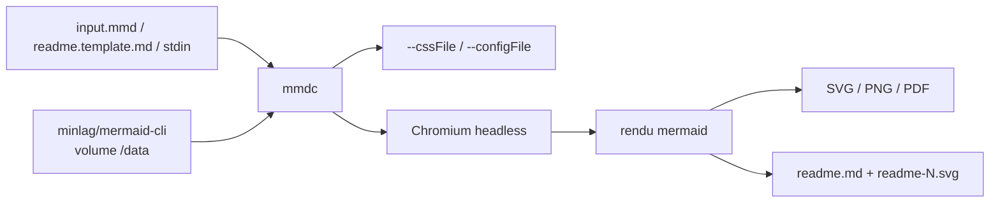

# mermaid-js/mermaid-cli

> Convertit en ligne de commande une définition Mermaid en SVG, PNG ou PDF.

## Le problème
Les diagrammes Mermaid ne se rendent que dans un navigateur ou une plateforme qui les supporte :
impossible de générer une image dans un script, un Makefile ou une CI sans bricolage.

## Ce que ça fait vraiment
`mmdc` prend un fichier `.mmd` et sort SVG, PNG ou PDF, avec thème (`-t dark`), fond transparent
(`-b transparent`) et CSS personnalisée en ligne (`--cssFile`). Il traite aussi un fichier Markdown
entier : il y trouve chaque bloc mermaid, produit un SVG par bloc et réécrit le Markdown avec les
références aux images, en respectant `accTitle` et `accDescr` pour l'alt et le title. Accepte
l'entrée sur stdin (`--input -`), et s'appelle depuis Node via `run()`.

## Comment c'est branché


## Essayer
```bash
npm install -g @mermaid-js/mermaid-cli
mmdc -i input.mmd -o output.svg
mmdc -i input.mmd -o output.png -t dark -b transparent
mmdc --input test-positive/flowchart1.mmd --cssFile test-positive/flowchart1.css -o docs/animated-flowchart.svg
mmdc -i readme.template.md -o readme.md
docker run --rm -u `id -u`:`id -g` -v /path/to/diagrams:/data minlag/mermaid-cli -i diagram.mmd
npx -p @mermaid-js/mermaid-cli mmdc -h
mmdc -h
```

## Coût et pièges
Gratuit. Le coût caché est le Chromium embarqué : d'où les problèmes connus de bac à sable Linux et
de permissions Docker listés en fin de README. L'installation globale échoue chez certains ;
l'installation locale ou `npx -p @mermaid-js/mermaid-cli mmdc` est le contournement documenté.

## Ce que ce n'est pas
Pas un éditeur ni un aperçu live. L'API Node **n'est pas couverte par semver** : elle suit le
versionnage de `mermaid`, donc une montée de version mineure peut casser un script. L'installation
par brew n'est plus supportée et ne livre qu'une vieille version. Du CSS en ligne peut être bloqué
par la Content-Security-Policy du site qui héberge le SVG.

## Alternatives
Aucune alternative nommée dans le README.

## Pour toi
À installer une fois pour toutes : rendre les diagrammes de tes docs en CI, sans navigateur ouvert.
