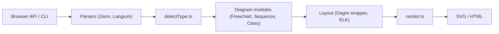

# mermaid-js/mermaid

> Bibliothèque JavaScript qui génère des diagrammes à partir de texte de type Markdown, pour documenter du code.

## Le problème
Les diagrammes dessinés dans un outil graphique sont longs à tenir à jour et vieillissent plus vite que le code.

## Ce que ça fait vraiment
On décrit un diagramme en texte (flowchart, séquence, classes, états, Gantt, camembert, git graph, journey, C4, mindmap…) ; Mermaid le parse (Jison et Langium), détecte le type, construit un modèle, calcule la disposition (Dagre ou ELK) et rend du SVG. Le rendu est natif dans GitHub, il existe un éditeur en ligne (mermaid.live), un mode sandbox contre les scripts malveillants, des thèmes et une config.

## Comment c'est branché


## Essayer
Le README ne donne pas de commande d'installation pour les utilisateurs (seule `npm publish` pour les mainteneurs). Exemple de syntaxe, du README :
```
flowchart LR
A[Hard] -->|Text| B(Round)
B --> C{Decision}
C -->|One| D[Result 1]
C -->|Two| E[Result 2]
```

## Coût et pièges
Gratuit. Le README avertit que la sanitisation ne garantit pas l'absence de failles ; pour du contenu d'utilisateurs externes, il propose un rendu dans une iframe sandbox, qui bloque certaines interactions.

## Ce que ce n'est pas
Pas un outil de dessin libre : la mise en page est automatique. Ce n'est pas non plus un outil de modélisation de données ou de business intelligence.

## Alternatives
Aucune alternative nommée dans le README.

## Pour toi
À adopter : les diagrammes en texte se versionnent avec le code et s'affichent dans GitHub, ce qui convient pour documenter un pipeline ou un flux MLOps.

