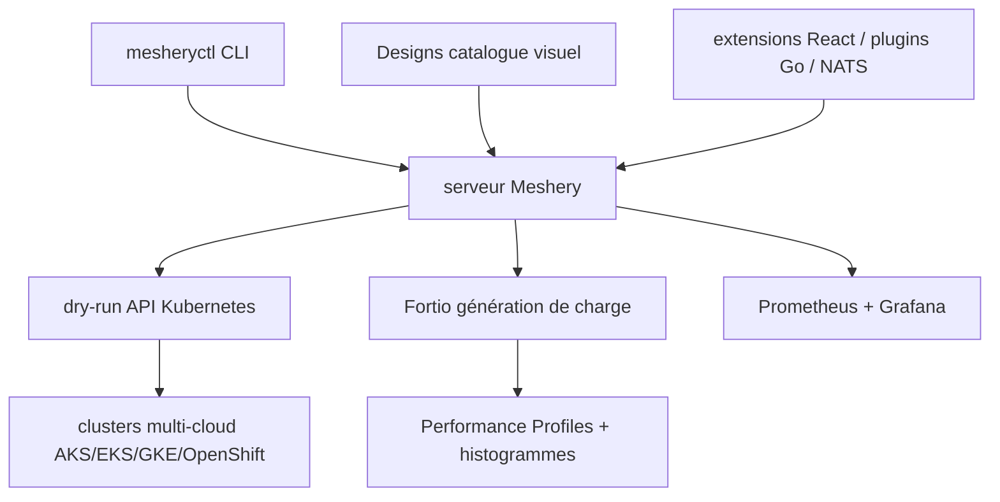

# meshery/meshery

> Plateforme CNCF de conception et de gestion visuelle d'infrastructures Kubernetes multi-cluster.

## Le problème
Gérer plusieurs clusters Kubernetes et des centaines de composants revient à empiler du YAML sans vue d'ensemble.
Valider une configuration avant de l'appliquer, et comparer les performances d'une version à l'autre, se fait à la main.

## Ce que ça fait vraiment
Conçoit et déploie des « Designs » visuellement, avec plus de 380 intégrations et des relations inférées entre composants.
Simule les déploiements via le dry-run natif de Kubernetes : validation syntaxique, détection de champs manquants ou de versions d'API incompatibles, aperçu des objets.
Génère de la charge avec Fortio (TCP, gRPC, HTTP), stocke des Performance Profiles, fait l'analyse statistique par histogrammes de latence et compare les tests entre eux.
Se branche sur Prometheus et Grafana pour les métriques cluster et applicatives ; les Workspaces organisent le travail d'équipe et les accès.

## Comment c'est branché


## Essayer
```bash
curl -L https://meshery.io/install | bash -
git clone --no-checkout --filter=blob:none https://github.com/meshery/meshery.git
cd meshery
git sparse-checkout set --no-cone '/*' '!/models/*' '/models/meshery-core/' '/models/kubernetes/' '!/docs/static/v0.8/'
git checkout master
```

## Coût et pièges
Le cœur est ouvert, mais plusieurs fonctions décrites (Workspaces, multi-joueur, snapshots dans les PR) passent par les extensions Meshery : à considérer comme freemium.
Piège de départ : un clone complet pèse des dizaines de gigaoctets à cause de `models/` et des archives de docs — le README recommande le clone creux.

## Ce que ce n'est pas
Pas un maillage de services : c'est un gestionnaire d'infrastructures cloud native, il en pilote plusieurs.
Pas un outil léger : un serveur, une base d'intégrations, des extensions ; ce n'est pas `kubectl apply`.
Pas un remplaçant de GitOps : il s'annonce « GitOps-centric », donc complément de vos dépôts.

## Alternatives
Aucune alternative nommée dans le README.

## Pour toi
À surveiller si tu opères plusieurs clusters ; pour un usage MLOps mono-cluster, c'est surdimensionné.
