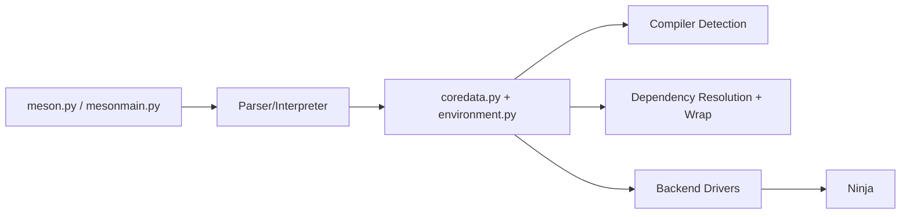

# mesonbuild/meson

> Système de build en Python qui génère des fichiers Ninja à partir de `meson.build`, pour projets C/C++ et autres.

## Le problème
Les builds C/C++ à base de Makefiles ou CMake sont verbeux, lents à configurer et difficiles à rendre portables.

## Ce que ça fait vraiment
Meson lit un fichier `meson.build`, détecte compilateurs et dépendances (avec sous-projets « wrap »), puis génère les fichiers d'un backend, Ninja en priorité, également Visual Studio ou Xcode. Il impose un répertoire de build distinct de la source. Nécessite Python 3.10+ et Ninja 1.8.2+.

## Comment c'est branché


## Essayer
```bash
python3 -m pip install meson
python3 -m pip install ninja
cd <source root>
meson setup builddir
ninja
ninja test
```

## Coût et pièges
Gratuit, Apache-2.0. Il faut Ninja et un compilateur. Les vieilles versions de Python sont figées sur d'anciennes versions de Meson (ex. 1.11 pour Python 3.7–3.9).

## Ce que ce n'est pas
Pas un gestionnaire de paquets ni un compilateur : il orchestre. Beaucoup d'issues ouvertes (2 256), signe d'un projet très large.

## Alternatives
Aucune nommée dans le README.

## Pour toi
À surveiller : utile si tu compiles des extensions C/C++ ou Rust pour du Python/ML, sinon hors périmètre quotidien.

