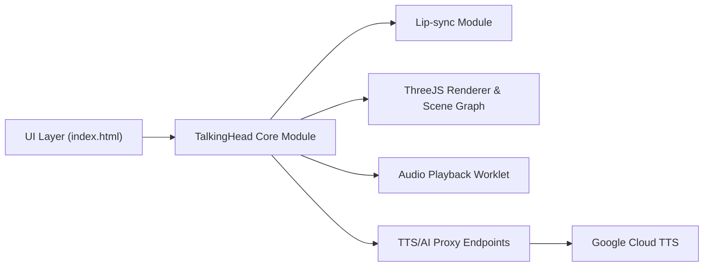

# met4citizen/TalkingHead

> Classe JavaScript pour un avatar 3D qui parle et synchronise les lèvres dans le navigateur.

## Le problème
Donner un visage animé à un agent conversationnel demande synthèse vocale, visèmes, rendu 3D et animation de corps.

## Ce que ça fait vraiment
Charge un avatar GLB au rig Mixamo avec formes ARKit et visèmes Oculus, rend avec Three.js, joue la voix avec synchronisation labiale native (anglais, allemand, français, finnois, lituanien). Utilise Google Cloud TTS par défaut ; ElevenLabs, Azure ou OpenAI via une application de test. Mode streaming audio, os dynamiques, gestes, humeurs. Modules complémentaires : HeadTTS (Kokoro, en navigateur), HeadAudio, MotionEngine.

## Comment c'est branché


## Essayer
```bash
git clone --depth 1 https://github.com/met4citizen/TalkingHead.git && rm -r TalkingHead/.git
```
```javascript
import { TalkingHead } from "talkinghead";
const head = new TalkingHead(nodeAvatar, { ttsEndpoint: "/gtts/", jwtGet: jwtGet, lipsyncModules: ["en", "fi"] });
```

## Coût et pièges
Google TTS offre 4 millions de caractères gratuits par mois selon l'auteur, au-delà facturé ; il déconseille de mettre une clé API côté client (proxy JWT décrit). Vérifier les licences des avatars (souvent non commerciales).

## Ce que ce n'est pas
Pas un agent : aucune logique de conversation. Il faut fournir la voix et l'IA.

## Alternatives
Aucune alternative nommée dans le README.

## Pour toi
À surveiller : brique utile pour un démonstrateur d'assistant vocal, mais front-end 3D avec coûts TTS et licences d'avatars à cadrer.

