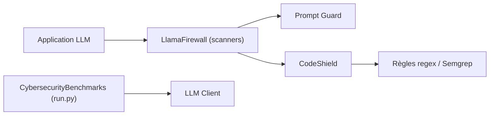

# meta-llama/PurpleLlama

> Ensemble d'outils et d'évaluations de Meta pour sécuriser les entrées et sorties des modèles génératifs.

## Le problème
Les applications LLM produisent du code non sûr, subissent des injections de prompt et peuvent aider des attaques informatiques.

## Ce que ça fait vraiment
Le README présente Llama Guard 3 (modération d'entrées/sorties), Prompt Guard (détection d'injections et jailbreaks), Code Shield (filtrage de code non sûr à l'inférence) et les benchmarks CyberSec Eval v1 à v3. D'après le code, le monorepo contient aussi LlamaFirewall (scanners enfichables) et une classification de documents sensibles sur Google Drive. Les modèles sont sur Hugging Face.

## Comment c'est branché


## Essayer
```bash
# Le README renvoie aux ressources du dépôt Llama-recipe et à
# l'exemple CodeShield (notebook). Aucune commande n'y figure.
```

## Coût et pièges
Les benchmarks appellent des LLM (API ou modèles locaux) ; les modèles Guard demandent du GPU. La licence est présente mais non identifiée par GitHub : à lire avant tout usage, notamment pour les modèles.

## Ce que ce n'est pas
Pas une solution clé en main : chaque composant s'intègre soi-même. Les benchmarks mesurent le risque, ils ne le suppriment pas.

## Alternatives
Aucune alternative nommée dans le README.

## Pour toi
À surveiller : Prompt Guard, Llama Guard et CyberSec Eval sont utiles pour évaluer et protéger une application LLM, mais lis la licence exacte avant de les embarquer.
