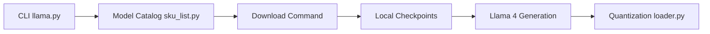

# meta-llama/llama-models

> Dépôt Meta : CLI de téléchargement des poids Llama et code d'inférence natif Llama 3 et 4.

## Le problème
Obtenir, vérifier et faire tourner les poids officiels Llama demande un parcours de licence et des scripts dédiés.

## Ce que ça fait vraiment
La CLI `llama-model` liste, décrit, télécharge, vérifie et supprime les modèles ; les poids sont obtenus après acceptation de la licence Meta (URL signée valable 24 h). Le code fournit l'inférence Llama 3/4, le prétraitement d'images Llama 4 et la quantification FP8/Int4.

## Comment c'est branché


## Essayer
```bash
pip install llama-models
llama-model list
llama-model download --source meta --model-id CHOSEN_MODEL_ID
pip install .[torch]
```

## Coût et pièges
Llama 4 Scout demande 4 GPU en bf16, 2 GPU 80 Go en FP8 ou 1 GPU 80 Go en Int4. Accès soumis à approbation et à la politique d'usage.

## Ce que ce n'est pas
Pas open source au sens strict : les poids ont leur propre licence. La licence du dépôt n'est pas identifiée par GitHub.

## Alternatives
Renvoie à Llama Stack pour exécuter les modèles via d'autres providers.

## Pour toi
À surveiller : source officielle des poids, mais pour l'inférence au quotidien, passer par un serveur dédié ; vérifier la licence avant tout usage commercial.

