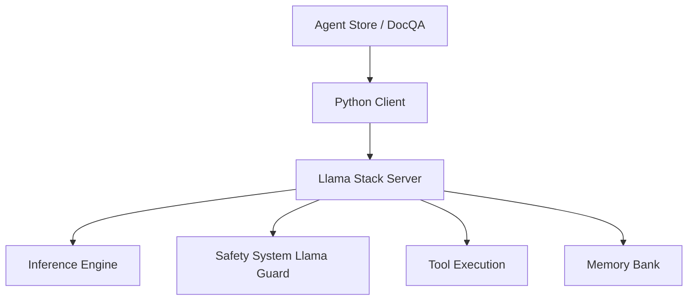

# meta-llama/llama-stack-apps

> Exemples d'applications à agents (Llama 3.1) qui parlent à un serveur Llama Stack.

## Le problème
Savoir concrètement comment brancher un agent (outils, sécurité, RAG) sur un serveur Llama Stack.

## Ce que ça fait vraiment
Scripts d'exemple : un agent simple (`examples.agents.hello`), un RAG avec base vectorielle, une appli de chat Gradio (agent_store). Les agents utilisent Llama Guard comme garde-fou et des outils comme Brave Search ou WolframAlpha, via un serveur sur le port 8321. Les diagrammes mentionnent aussi des démos mobiles (iOS, Android).

## Comment c'est branché


## Essayer
```bash
conda create -n stack python=3.10
pip install -r requirements.txt
export TAVILY_SEARCH_API_KEY=[KEY]
python -m examples.agents.hello localhost 8321
```

## Coût et pièges
Il faut d'abord démarrer un serveur Llama Stack (dépôt séparé). Clés Tavily/Brave/Wolfram pour les outils. Conda requis pour installer une distribution.

## Ce que ce n'est pas
Pas un framework : des exemples liés à l'API Llama Stack de 2024, probablement dépassée par le renommage en OGX.

## Alternatives
- llama-stack : le serveur lui-même, à préférer pour partir du bon côté.

## Pour toi
À ignorer : exemples datés dépendant d'un serveur qui a depuis changé de nom ; lis plutôt la doc du serveur actuel.
