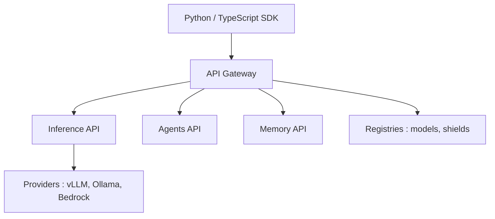

# meta-llama/llama-stack

> Serveur d'API compatible OpenAI, rebaptisé OGX, pour exécuter des applications à agents sur n'importe quel modèle.

## Le problème
Chaque fournisseur de modèle a son API ; changer de modèle ou d'infra oblige à réécrire l'application.

## Ce que ça fait vraiment
OGX expose des endpoints OpenAI (chat, embeddings, Responses API, vector stores, files, batches), plus Anthropic (/v1/messages) et Google GenAI. Il route vers des fournisseurs enfichables (Ollama, vLLM…). La Responses API gère l'orchestration côté serveur : appel d'outils, MCP, recherche de fichiers (RAG). Des « skills » versionnés sont gérés en /v1alpha.

## Comment c'est branché

(Composants d'un schéma qui date de l'ère Llama Stack ; le README actuel décrit OGX.)

## Essayer
```bash
uv pip install ogx
uv run ogx go
```

## Coût et pièges
Gratuit, mais il faut un fournisseur d'inférence derrière (Ollama local, vLLM, cloud). Le projet a changé de nom et de mission : dépôt d'origine à recouper avec ogx-ai/ogx.

## Ce que ce n'est pas
Pas un modèle ni une bibliothèque d'agents : c'est le serveur qui les héberge. Le diagramme fourni est ancien par rapport au README.

## Alternatives
- Aucune alternative nommée dans le README.

## Pour toi
À surveiller : une passerelle OpenAI-compatible multi-fournisseurs est utile en MLOps, mais le renommage et l'alpha des skills invitent à attendre une stabilisation.
