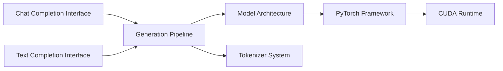

# meta-llama/llama

> Code d'inférence minimal de Llama 2, déprécié au profit des dépôts Llama Stack.

## Le problème
Charger les poids Llama 2 officiels et lancer une inférence de référence locale.

## Ce que ça fait vraiment
`model.py`, `tokenizer.py`, `generation.py` et deux exemples (complétion de texte, chat) lancés via `torchrun`.
Modèles 7B à 70B ; parallélisme de modèle MP = 1, 2 ou 8 selon la taille ; contexte 4096 tokens.
Téléchargement des poids via `download.sh` et une URL signée reçue par e-mail après acceptation de la licence.
**Déprécié** depuis Llama 3.1.

## Comment c'est branché


## Essayer
```bash
pip install -e .
./download.sh
torchrun --nproc_per_node 1 example_chat_completion.py --ckpt_dir llama-2-7b-chat/ --tokenizer_path tokenizer.model --max_seq_len 512 --max_batch_size 6
```

## Coût et pièges
GPU + CUDA ; inscription chez Meta, liens de téléchargement expirant en 24 h. Dernier push en janvier 2025.

## Ce que ce n'est pas
Pas le dépôt courant de Llama. Pas d'outillage fine-tuning ni de serving. Licence propre à Meta, non identifiée par GitHub.

## Alternatives
- meta-llama/llama-models : poids, model cards, licence.
- meta-llama/llama-cookbook : scripts et intégrations communautaires.
- meta-llama/PurpleLlama : sécurité et garde-fous.

## Pour toi
Archive historique ; ignorer, passer par llama-models ou Hugging Face.
