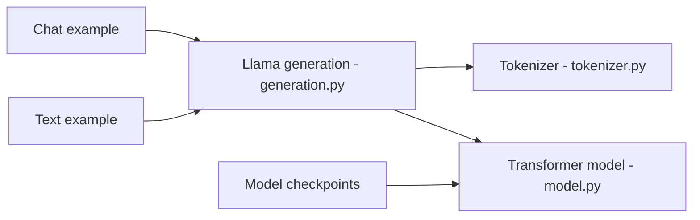

# meta-llama/llama3

> Dépôt obsolète d'inférence minimale pour Llama 3 (8B et 70B), remplacé par d'autres dépôts Meta.

## Le problème
Charger et interroger localement les poids Llama 3 avec un code de référence simple.

## Ce que ça fait vraiment
Exemples `example_chat_completion.py` et `example_text_completion.py` lancés via `torchrun`, avec un tokenizer (tiktoken), le formatage de chat et un Transformer. Les poids se demandent sur le site de Meta (URL signée par email, valable 24 h) ou sur Hugging Face après acceptation de la licence.

## Comment c'est branché


## Essayer
```bash
pip install -e .
torchrun --nproc_per_node 1 example_chat_completion.py \
    --ckpt_dir Meta-Llama-3-8B-Instruct/ \
    --tokenizer_path Meta-Llama-3-8B-Instruct/tokenizer.model \
    --max_seq_len 512 --max_batch_size 6
```

## Coût et pièges
GPU requis (8B : 1 GPU, 70B : 8 selon le tableau MP). Accès aux poids soumis à une demande et à l'acceptation de la licence. Dépôt archivé, dernier push en janvier 2025.

## Ce que ce n'est pas
Pas le dépôt à utiliser aujourd'hui : le README lui-même le déclare déprécié au profit de llama-models, PurpleLlama, llama-toolchain, llama-agentic-system et llama-cookbook.

## Alternatives
- llama-models : dépôt central des modèles de fondation.
- llama-cookbook : scripts et intégrations communautaires.
- llama-toolchain : inférence, fine-tuning, sécurité.

## Pour toi
À ignorer : archivé et déprécié par ses auteurs ; partir des dépôts de remplacement ou de Hugging Face.

